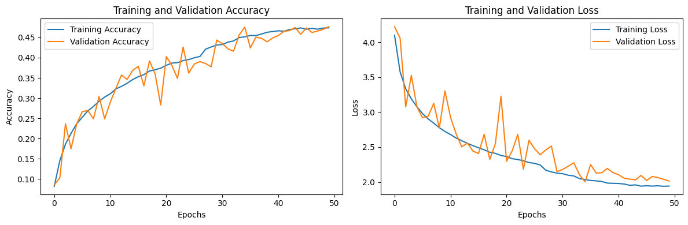

* Make a CNN architecture and train it for CIFAR100 classification
> Architecture should not be exactly same as of existing famous architectures like : LeNet-5, Alexnet etc. You can make your own inspired from them.
> **If it takes time in training, you can use free GPU available on google colab and if GPU units get exausted on you one google accoount, you can use anohter google account for training :)**
* Plot necessary graphs related to training model
  

# CIFAR-100 Image Classification using CNN in TensorFlow

This project implements a Convolutional Neural Network (CNN) for image classification on the [CIFAR-100](https://www.cs.toronto.edu/~kriz/cifar.html) dataset using TensorFlow and Keras.

## Contents

- Data preprocessing
- Data augmentation
- CNN architecture with BatchNorm, Dropout, and GlobalAveragePooling
- Model training with validation
- Accuracy evaluation
- Learning rate scheduling for stable training

## Dataset

- **CIFAR-100**: 100 classes, 60,000 32x32 color images (50,000 train / 10,000 test).
- Loaded via `tf.keras.datasets.cifar100`.

## Model Architecture

The CNN model includes:

- Multiple convolutional blocks with:
  - `Conv2D`, `BatchNormalization`, `LeakyReLU`, `MaxPooling2D`, `Dropout`
- `GlobalAveragePooling2D` instead of `Flatten`
- Dense layer with `BatchNorm`, `LeakyReLU`, and `Dropout`
- Final softmax output for 100 classes

## Training Details

- Optimizer: `Adam`
- Initial Learning Rate: `1e-3`
- Loss: `categorical_crossentropy`
- Metrics: `accuracy`
- Batch size: 64
- Epochs: 50
- Learning rate scheduler: `ReduceLROnPlateau` (patience=3, factor=0.5)

## Results

- **Final Test Accuracy:** `0.48`

## Inference

- The model achieves a final **test accuracy of 48%** on the CIFAR-100 dataset.
- **Training and validation accuracy** curves show consistent improvement across epochs.
- **Validation loss** decreases steadily, with minor fluctuations, suggesting reasonable generalization.
- **No severe overfitting** is observed due to use of BatchNorm, Dropout, and data augmentation.