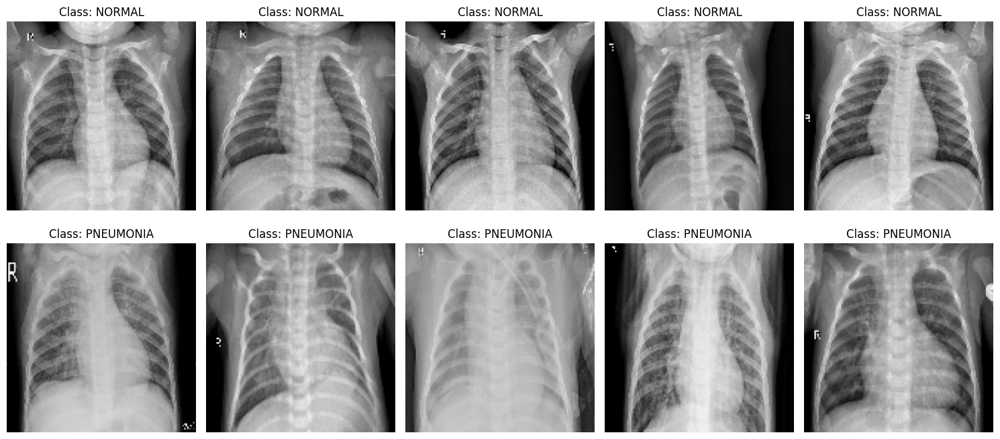
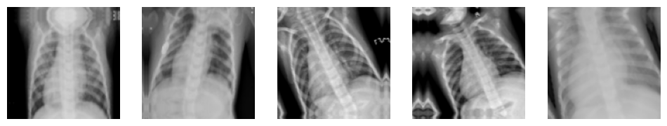
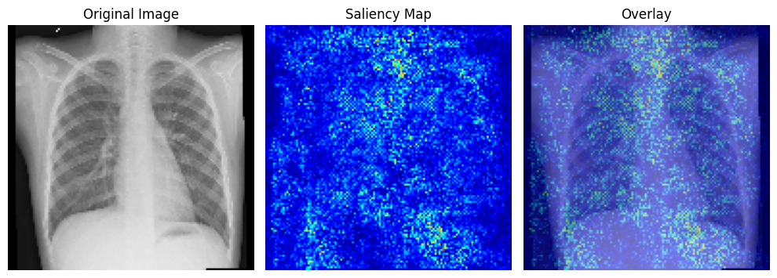
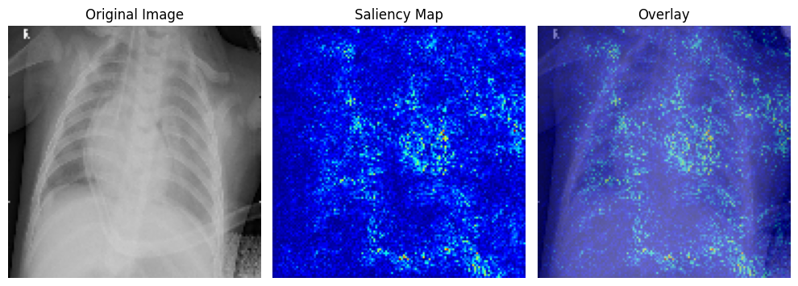
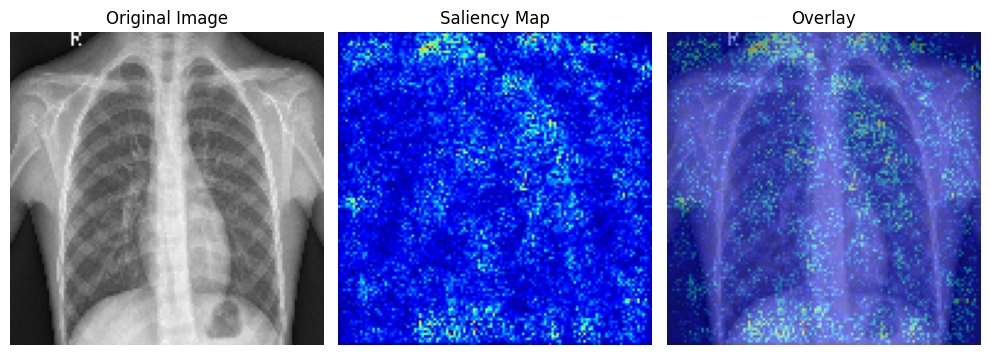
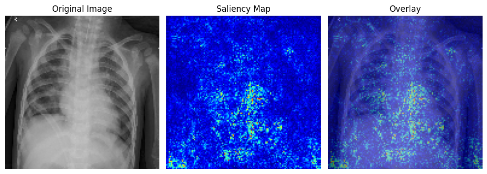

# 🫁 Pneumonia Detection from Chest X-rays

An end-to-end deep learning project that classifies chest X-ray images into **Normal** or **Pneumonia** using **MobileNetV2** with transfer learning. The project includes model training, fine-tuning, Grad-CAM explainability, and a Gradio demo — all developed and executed in **Google Colab**.

---

## 📌 Features

- 🧠 Binary classification: **Normal** vs **Pneumonia**
- ⚙️ Transfer learning with **MobileNetV2**
- 🎯 Fine-tuning to improve performance
- 📊 Visualizations: training accuracy/loss curves
- 🔍 Model explainability with **Saliency Maps**
- 💻 Interactive **Gradio interface**
- 💾 Trained model export for inference or deployment

---

## 🗃️ Dataset

- **Source**: [Kaggle - Chest X-Ray Images (Pneumonia)](https://www.kaggle.com/paultimothymooney/chest-xray-pneumonia)

The folder structure follows:

```bash
chest_xray/
├── train/
│   ├── NORMAL/
│   └── PNEUMONIA/
├── val/
│   ├── NORMAL/
│   └── PNEUMONIA/
├── test/
│   ├── NORMAL/
│   └── PNEUMONIA/
```


---

## 🚀 How to Use

### 📍 Run on Google Colab

1. Open the notebook: `Assignment3-Part3.ipynb`
2. Upload your Kaggle API token to access the dataset
3. Run all cells to:
 - Preprocess the data
 - Train and fine-tune the model
 - Visualize training metrics and Grad-CAM outputs
 - Launch the Gradio app using `xray_app.py`

---

## 🧪 Training and Model Details

- Used **MobileNetV2** as the base with custom top layers
- Optimized using **Adam** and `sparse_categorical_crossentropy` loss
- Applied **early stopping** to avoid overfitting
- Handled **class imbalance** with class weights
- Performed **fine-tuning** on top layers
- Used **data augmentation** for generalization

### 📈 Training Accuracy & Loss  


### 🖼️ Augmented Sample  


### 📊 Confusion Matrices  
- **Before Fine-tuning**  


- **After Fine-tuning**  


---

## 📊 Results

| Model             | Test Accuracy |
|------------------|----------------|
| Base MobileNetV2 | **82.81%**     |
| Fine-tuned Model | **86.25%**     |

---

## 🧠 Grad-CAM (Saliency Map) Examples

- **Normal (Before Fine-tuning)**  


- **Pneumonia (Before Fine-tuning)**  


- **Normal (After Fine-tuning)**  


- **Pneumonia (After Fine-tuning)**  


---

## 🌐 Gradio Demo

Launch the demo by running `xray_app.py` using the saved model `pneumonia_model.keras`.  
You’ll be able to:
- Upload multiple chest X-ray images at once
- Get a real-time prediction: **Normal** or **Pneumonia**

---

## 🛠 Tech Stack

- Python (Google Colab)
- TensorFlow / Keras
- MobileNetV2
- Grad-CAM
- Gradio
- Matplotlib / Seaborn

---

## 👩‍💻 Author

Made with ❤️ by [Sreeja](https://github.com/psreeja1007)  
Project for **Winter in Data Science (WiDS)** — *Web and Coding Club, IIT Bombay*
