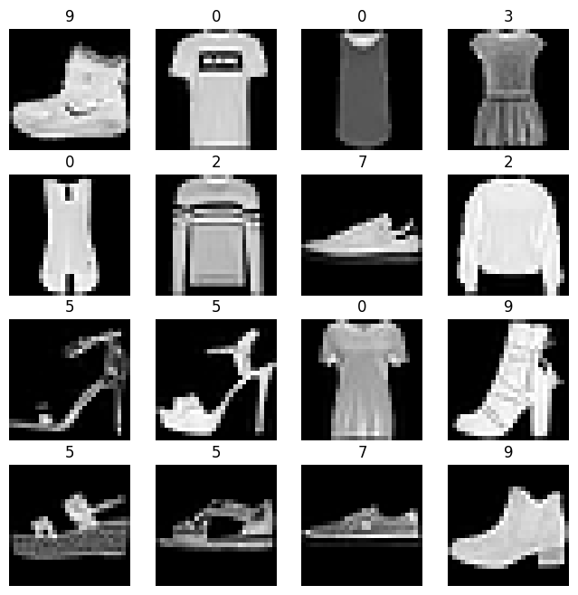
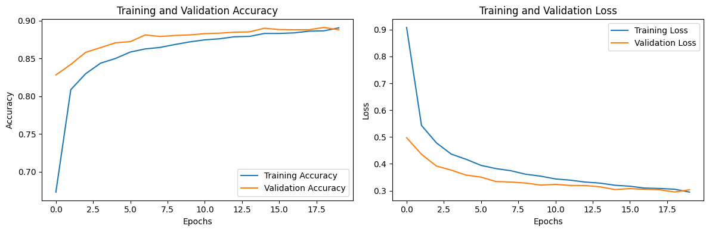
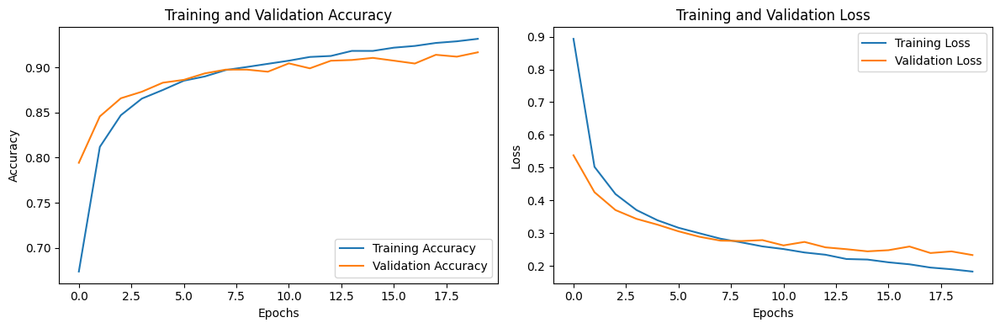

In Week 2, I gave you an optional assignment. 
Whose solution is [here](https://github.com/shoryasethia/fashion-mnist )
* Now your task is to use a CNN architecture on fashion-mnist and compare accuracy with MLP models.

# Fashion MNIST Classification using MLP and CNN

This project explores the use of two neural network architectures—**a Multi-Layer Perceptron (MLP)** and a **Convolutional Neural Network (CNN)**—to classify images from the Fashion MNIST dataset. The goal is to compare their performance in recognizing various types of clothing items.

## Dataset Overview

Fashion MNIST is a dataset of 70,000 grayscale images (28x28 pixels) spread across 10 clothing categories:

- T-shirt/top
- Trouser
- Pullover
- Dress
- Coat
- Sandal
- Shirt
- Sneaker
- Bag
- Ankle boot

The dataset is divided into 60,000 training images and 10,000 test images.

## Training Info
We have trained the dataset on the following models
- MLP
- CNN

## Performance Comparison

| Model | Architecture                  | Test Accuracy |
|-------|-------------------------------|---------------|
| MLP   | Dense + LeakyReLU + Dropout   | 0.88          |
| CNN   | Conv + Pool + Dense + Dropout | 0.91          |

The CNN model outperformed the MLP due to its ability to extract and learn local spatial features from the images.

- MLP training plot

- CNN training plot
