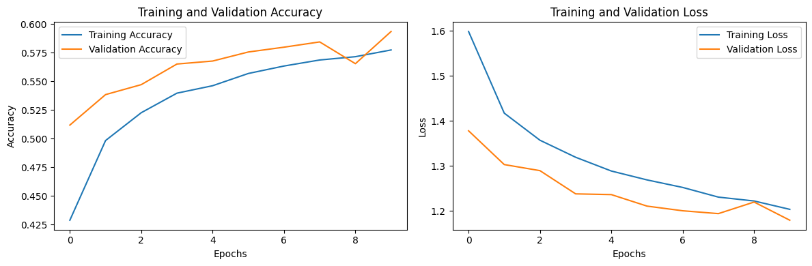
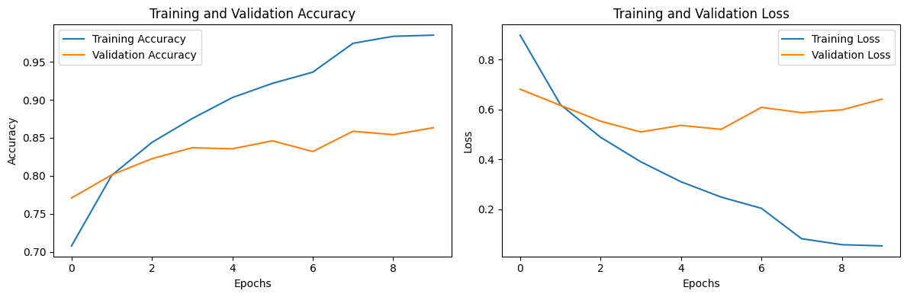

* Load a pre-trained model (either VGG16 or VGG19 or InceptionV3)
* Check its accuracy using weights of `imagnet` dataset only on CIFAR10 dataset.
> Problem you will face, try to resolve it as well : imagnet had 1000 classes whereas CIFAR10 has only 10 classes
* Transfer Learning : Fine-Tune the chosen pre-trained model on CIFAR10 and then compare them
  

# CIFAR-10 Image Classification using a pre-trained base model

This project demonstrates how to first use a pretrained machine learning model for classification and then fine-tune it to improve performance. The workflow includes dataset preprocessing, model loading, fine-tuning, evaluation, and analysis of results.

## Task Overview

- **Step 1:** Load and use a pretrained model to perform initial classification.
- **Step 2:** Fine-tune the model on the given dataset to enhance accuracy.
- **Step 3:** Evaluate and compare results between the pretrained and fine-tuned models.

## Dataset

The dataset contains feature vectors and class labels for classification. Preprocessing steps include:

- Handling missing values
- Encoding categorical features
- Feature scaling (normalization or standardization)
- Splitting data into training and testing sets

## Training Details

- **Pretrained Model:** Loaded and trained the model for the extra layers freezing the layers in base model
- **Fine-tuning:**
  - Unfreezed the base model layers and did the training again

## Results

- **Pretrained Model Accuracy:** *0.59*  

- **Fine-tuned Model Accuracy:** *0.86*

## Inference

Fine-tuning the pretrained model improves classification accuracy. While the pretrained model gives a solid baseline, adapting the model to the specific dataset through fine-tuning yields better performance and more accurate predictions.
