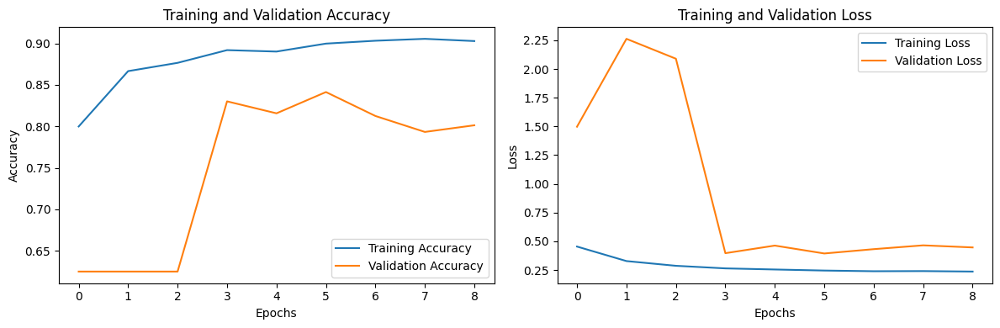

* **Make Pneumonia or Normal classifier based on Chest X-Ray**
> It will take time in training!
* Download data from [here](https://www.kaggle.com/datasets/paultimothymooney/chest-xray-pneumonia)
* Or if you are using google colab GPU or even colab, you can load data in google colab by running following
```
!pip install kaggle
!mkdir ~/.kaggle
!mv kaggle.json ~/.kaggle/
!kaggle datasets download -d paultimothymooney/chest-xray-pneumonia
!unzip chest-xray-pneumonia.zip
```
> **Accuracy on testing data should be more than 60%**


# Pneumonia Detection from Chest X-Rays using CNN (TensorFlow/Keras)

This project implements a Convolutional Neural Network (CNN) to classify chest X-ray images into two categories: **Pneumonia** and **Normal**. It uses TensorFlow and Keras, along with data augmentation and regularization techniques, to improve generalization and prevent overfitting.


## 🩻 Dataset

The dataset contains grayscale chest X-ray images and is divided into two classes:

- **NORMAL**: Images of healthy lungs.
- **PNEUMONIA**: Images showing pneumonia-infected lungs.

The folder structure follows:

data/
├── train/
│ ├── NORMAL/
│ └── PNEUMONIA/
├── test/
│ ├── NORMAL/
│ └── PNEUMONIA/


## 🧠 Model Overview

The model is a custom CNN architecture built from scratch, consisting of:

- Multiple convolutional blocks with increasing filter sizes: 32, 64, 128, 256.
- Each block includes Batch Normalization, LeakyReLU activation, and Max Pooling.
- Flattening followed by a fully connected Dense layer of 512 units.
- Dropout regularization (rate = 0.5) to reduce overfitting.
- Final Dense layer with sigmoid activation for binary classification.


## 📈 Training Strategy

- **Data Augmentation**: Applied to the training set to introduce variations:
  - Rescaling
  - Shear transformations
  - Zooming
  - Horizontal flipping

- **Regularization Techniques**:
  - Batch Normalization after every convolutional layer
  - Dropout in the fully connected layer
  - LeakyReLU activations for better gradient flow

- **Optimization**:
  - Adam optimizer with a learning rate of `1e-4`
  - Binary crossentropy as the loss function
  - EarlyStopping and ReduceLROnPlateau callbacks for adaptive learning


## ✅ Results

- **Final Test Accuracy**: **84.13%**
- The model demonstrates good generalization on unseen validation data and can serve as a baseline for medical image diagnosis tasks.


