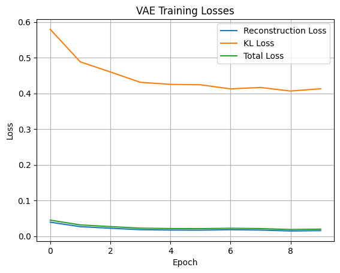
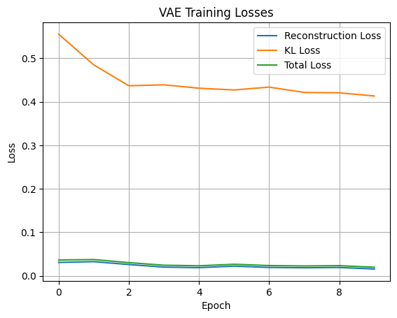
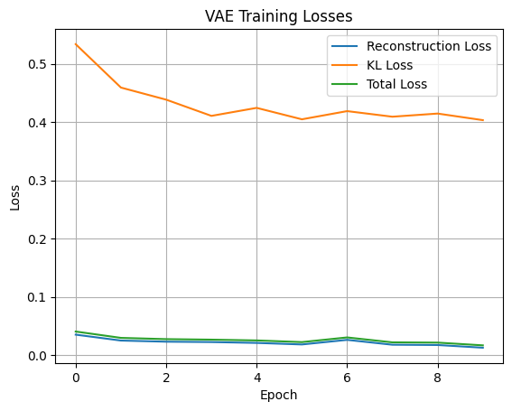
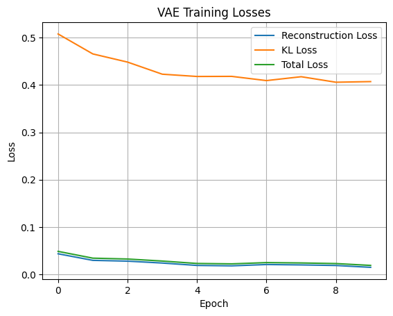
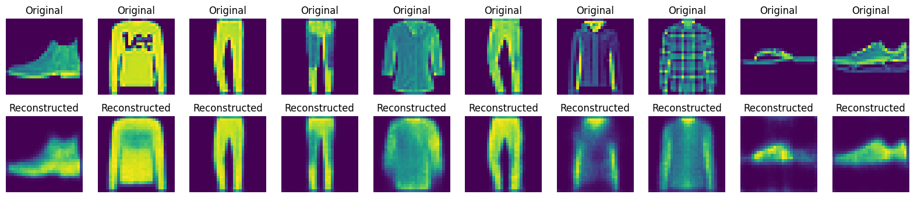
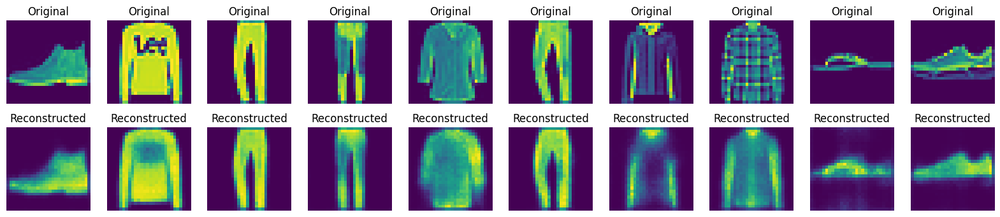
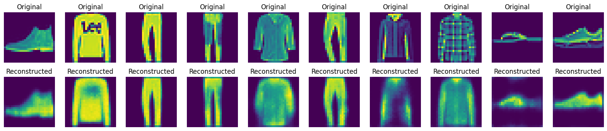
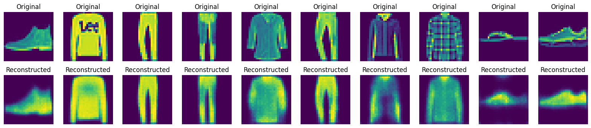

# Comparison of VAE Architectures on Fashion MNIST

## Aim
The aim of this experiment is to compare the performance of four different Variational Autoencoder (VAE) architectures on a subset of the Fashion MNIST dataset. Each model uses convolutional layers and is trained using a combined loss function consisting of Mean Squared Error (MSE) and Kullback-Leibler (KL) divergence. This study investigates how different encoder-decoder configurations affect the reconstruction quality, training efficiency, and total VAE loss.

## Dataset

- **Dataset**: Fashion MNIST
- **Number of training images**: 3000
- **Image size**: 28 × 28 pixels
- **Channels**: 1 (Grayscale)
- **Normalization**: Pixel values scaled to [0, 1]

## Architectures

All models are built using the following common components:
- **Conv2D** and **Conv2DTranspose** layers
- **Batch Normalization**
- **Leaky ReLU** activations
- **Dense layers**

### Model Variants

| Model | Encoder Type | Decoder Type |
|-------|--------------|--------------|
| **Model 1** | Vanilla Conv Encoder | Vanilla Conv Decoder |
| **Model 2** | Encoder with Encoder-Decoder Block | Vanilla Conv Decoder |
| **Model 3** | Vanilla Conv Encoder | Decoder with Encoder-Decoder Block |
| **Model 4** | Encoder with Encoder-Decoder Block | Decoder with Encoder-Decoder Block |

## Training Results (10 Epochs)

| Model | KL Loss | Reconstruction Loss | Total Loss | Training Time |
|-------|---------|---------------------|------------|----------------|
| **Model 1** | 0.4128 | 0.0149 | 0.0190 | 36.06 sec |
| **Model 2** | 0.4147 | 0.0151 | 0.0192 | 26.16 sec |
| **Model 3** | 0.4082 | 0.0163 | 0.0204 | 28.15 sec |
| **Model 4** | 0.4077 | 0.0168 | 0.0209 | 31.67 sec |

## Training History Plots

Each model's training process is tracked through the following plots:

- **Total Loss vs Epochs**
- **KL Divergence vs Epochs**
- **Reconstruction Loss vs Epochs**

### Model 1

### Model 2

### Model 3

### Model 4

## Prediction Plots

### Model 1

### Model 2

### Model 3

### Model 4

## Inference

- Model 1 achieves the best performance in terms of total VAE loss, although it takes slightly more time to train than Model 2.

- Model 2 offers a trade-off: it trains faster while maintaining similar performance, making it a viable alternative to a vanilla VAE.

- Models 3 and 4, with more complex decoders, show increased reconstruction loss. This indicates that architectural complexity does not always translate to better performance—especially on simpler datasets like Fashion MNIST.

- Overall, simplicity in design can still yield excellent results, and thoughtful enhancements can balance performance and efficiency.