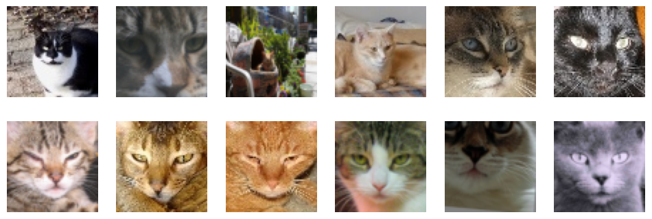
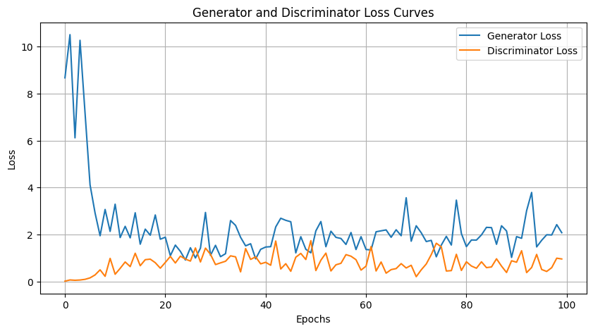
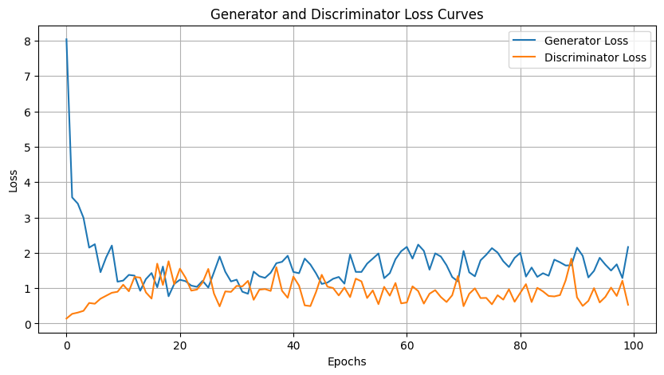
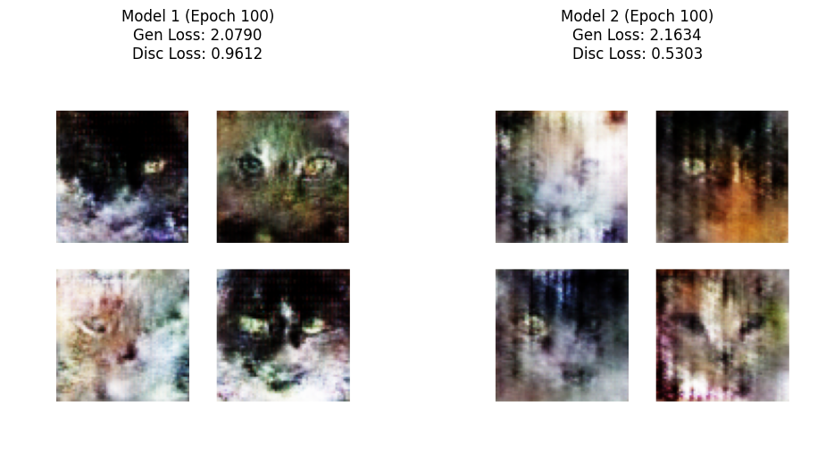

# DCGAN Implementation on Cats Dataset

## Overview  
In this assignment, I implemented a **Deep Convolutional Generative Adversarial Network (DCGAN)** to generate realistic images.

## Dataset
- The dataset used is:
Borhani, T. (2022). *Cat Dataset* [Data set]. Kaggle. [https://www.kaggle.com/datasets/borhanitrash/cat-dataset](https://www.kaggle.com/datasets/borhanitrash/cat-dataset)

- Number of Images: 29,843

- Image Size: 64 x 64 pixels

- Image Format: PNG

- Image Resolution: RGB (3 channels)

- I have used only 10000 out of them for fast training

## Architecture of the Models
I have usedtwo models with same discriminator and different generators
- Used a **CNN-based generator** with **Transposed Convolutions** to upscale images.  
- Used a **CNN-based discriminator** with **Batch Normalization** and **Leaky ReLU**.
- First generator has 2 Convolutional layers while the seond one has 3 of them

## Training Details  
- Trained the model with **Binary Crossentropy loss** and **Adam optimizer**.  
- Compared **two different models** with varying architectures

- First Model's History plot

- Second Model's History plot

## Results  
| Model | Generator Loss | Discriminator Loss |
|-------|---------------|--------------------|
| First Model | 0.91 | 0.06 |
| Second Model | 0.77 | 0.14 |

- The **Generator loss** decreased from **0.91 to 0.77**, indicating improved image generation quality.  
- The **Discriminator loss** increased from **0.06 to 0.14**, suggesting better ability to distinguish real vs. fake images.  

## **Inference**
1. The improved **Generator** structure in the second model:
   - Led to **lower and more stable Generator losses**.
   - Produced **slightly better image quality**, though further training may amplify this improvement.
2. The first model exhibited **greater fluctuations in Generator loss** and **poorer image quality** overall.

## Conclusion  
This study demonstrates the importance of **fine-tuning architectures and hyperparameters** in GANs. The second model showed improved performance with a **better balance between Generator and Discriminator** losses.